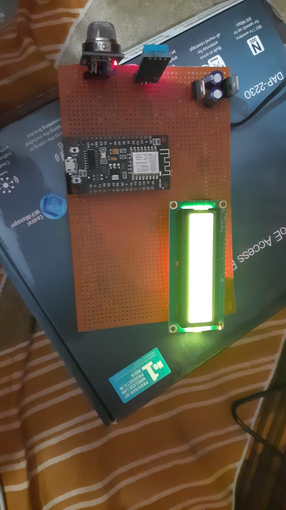

# Air_quality_monitoring_system
This is an monitoring system that helps to detect air temperature ,humidity and gas quality using different sensor and then using esp8266 sends it to backend server.

<h1>Our hardware setup</h1>

the data hits our backend server once there is data for a day we send the mail to registered customers about the air quality.

<h2 style="color:rgb(240,0,0);">Work in progress..</h2>

